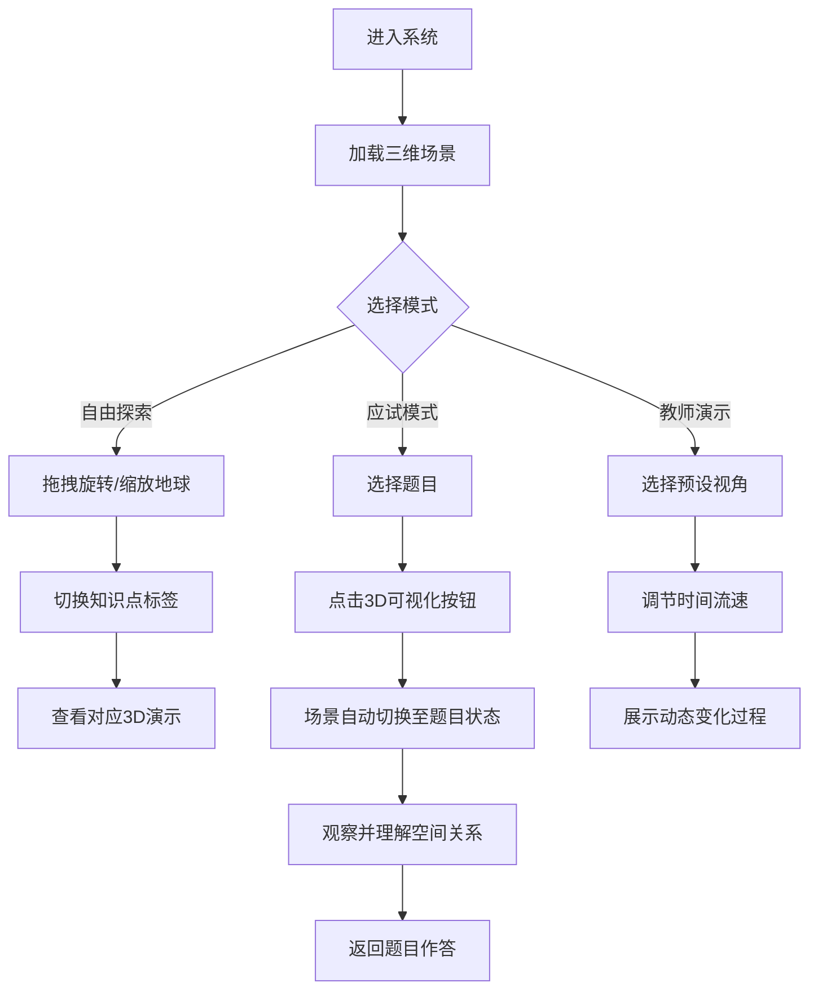

## 1. 产品概述

面向高中地理教学的交互式三维可视化实验系统，聚焦人教版高中地理必修一第一章「地球的运动」。系统通过 Three.js 构建逼真的太阳-地球-月球三维场景，将抽象的课本知识点（自转、公转、黄赤交角、昼夜长短、正午太阳高度等）转化为可交互、可操控的视觉体验，并结合高频高考题型设计交互式实验按钮，帮助学生建立空间思维，提升解题能力。

- **目标用户**：高中地理学生、地理教师
- **核心价值**：将二维题目转化为三维可视化场景，让学生「看到」题目中的空间关系，在头脑中留下深刻的思维模型

## 2. 核心功能

### 2.1 功能模块

1. **三维场景主页**：太阳-地球-月球系统实时渲染，支持自由旋转/缩放/平移
2. **知识点实验面板**：按章节知识点分类，每个知识点对应一个可交互的3D实验
3. **应试交互模块**：精选高考真题，每题配套一个交互式按钮，一键切换题目对应的3D场景状态
4. **控制面板**：时间流速控制、视角切换、标注显示/隐藏、参数调节

### 2.2 页面详情

| 页面名称 | 模块名称 | 功能描述 |
|---------|---------|---------|
| 三维主场景 | 太阳-地球-月球系统 | 实时3D渲染天体运动，地球自转+公转，月球绕地，黄赤交角可见 |
| 三维主场景 | 场景控制栏 | 旋转/缩放/平移，视角预设（俯视/侧视/北极/赤道），时间流速滑块 |
| 知识点面板 | 地球自转 | 展示自转方向(西→东)、地轴指向北极星、角速度/线速度对比、昼夜交替 |
| 知识点面板 | 地球公转 | 展示椭圆轨道、近日点/远日点、公转速度变化、回归年 |
| 知识点面板 | 黄赤交角 | 展示赤道面与黄道面的23°26′夹角、地轴倾斜方向 |
| 知识点面板 | 太阳直射点回归运动 | 展示直射点在南北回归线之间的周年移动轨迹 |
| 知识点面板 | 昼夜长短变化 | 展示不同纬度/不同日期的昼弧夜弧比例变化 |
| 知识点面板 | 正午太阳高度变化 | 展示不同纬度正午太阳高度角的季节变化 |
| 知识点面板 | 时区与地方时 | 展示晨昏线、不同经度的地方时差异、国际日期变更线 |
| 应试交互模块 | 真题题库 | 精选高考/模拟题，每道题配「3D可视化」按钮，一键切换场景 |
| 应试交互模块 | 题型分类 | 按题型分类：太阳高度角计算、昼夜长短判断、时间计算、直射点位置等 |

## 3. 核心流程

## 4. 用户界面设计

### 4.1 设计风格

- **主题**：深色太空主题，科技感与教育感并重
- **主色调**：深邃太空蓝(#0a0e27)底色，搭配青蓝色(#00d4ff)科技强调色，暖金色(#f0c060)用于太阳和高亮
- **字体**：标题使用「站酷高端黑」或系统黑体，正文使用「思源黑体」或系统无衬线字体
- **布局**：左侧知识点面板(可收起)，右侧3D场景全屏，底部控制栏，右上角题目抽屉
- **按钮**：半透明玻璃态按钮，带发光边框，hover时发光增强
- **图标**：使用简洁线性图标，与科技主题一致

### 4.2 页面设计概览

| 页面名称 | 模块名称 | UI元素 |
|---------|---------|--------|
| 三维主场景 | 3D画布 | 全屏Three.js画布，深空背景+星空粒子，太阳带光晕，地球带纹理+大气层 |
| 三维主场景 | 顶部标题栏 | 系统名称「地球的运动 · 3D交互实验」，右侧工具栏图标 |
| 三维主场景 | 左侧知识点面板 | 半透明玻璃面板，树形菜单结构，一级为知识点分类，二级为具体实验，含图标 |
| 三维主场景 | 底部控制栏 | 时间流速滑块，播放/暂停按钮，视角预设按钮组，当前日期显示 |
| 三维主场景 | 右上角题目抽屉 | 从右侧滑出的半透明面板，题目列表+「3D可视化」按钮，点击后场景联动 |
| 三维主场景 | 信息提示浮层 | 关键参数实时显示（太阳直射点纬度、晨昏线、正午太阳高度角等） |

### 4.3 响应式设计

- 桌面端优先，1920×1080为基准分辨率
- 平板端适配：面板自动折叠，触摸手势支持
- 移动端暂不作为主要目标，但保证基本可访问

### 4.4 3D场景指导

- **环境**：深空背景，使用星空粒子系统(2000+粒子)，营造宇宙沉浸感
- **光照**：点光源置于太阳位置(暖黄色)，环境光补充暗面细节，地球表面使用Phong材质
- **相机**：默认透视相机，初始距离约15单位，支持OrbitControls(旋转/缩放/平移)，阻尼惯性
- **组合**：太阳居中，地球绕太阳公转轨道(椭圆)，月球绕地球轨道，地轴倾斜23°26′
- **交互**：鼠标悬停高亮天体，点击显示信息标签，拖拽旋转场景，滚轮缩放
- **特效**：太阳光晕(glow shader)，地球大气层(透明球壳)，轨道线(虚线环)，晨昏线(半透明半球)
- **资源**：地球纹理使用NASA Blue Marble贴图，太阳使用程序化生成，月球使用程序化纹理

## 5. 知识点与应试映射

### 5.1 知识点覆盖

| 知识点 | 3D可视化方式 | 交互操作 |
|-------|------------|---------|
| 自转方向 | 箭头指示+动态旋转 | 切换自转速度，正反转对比 |
| 昼夜交替 | 半透明晨昏面+光照对比 | 旋转地球观察昼夜分界 |
| 时区计算 | 经线标注+地方时数字显示 | 点击任意经线查看地方时 |
| 公转轨道 | 椭圆轨道线+速度变化 | 拖动地球位置观察速度 |
| 黄赤交角 | 赤道面+黄道面半透明平面 | 切换显示/隐藏参考面 |
| 太阳直射点 | 地球上高亮光斑+纬线标注 | 拖动时间滑块观察移动 |
| 昼夜长短 | 昼弧/夜弧彩色标注 | 切换纬度/日期观察变化 |
| 正午太阳高度 | 动态角度标注线 | 切换纬度观察角度变化 |

### 5.2 典型真题题型映射

| 题型 | 题目示例 | 3D场景联动 |
|-----|---------|-----------|
| 太阳直射点判断 | 给出日期，判断直射点半球及移动方向 | 场景自动跳转到该日期，高亮直射点 |
| 昼夜长短比较 | 比较两地昼夜长短 | 场景同时标注两地昼弧长度 |
| 正午太阳高度计算 | 计算某地某日正午太阳高度角 | 场景展示角度测量线与数值 |
| 时间计算 | 已知某地时间求另一地 | 场景展示晨昏线与两地经度差 |
| 日出日落方位 | 判断某地某日日出方位 | 场景展示该地日出方向箭头 |