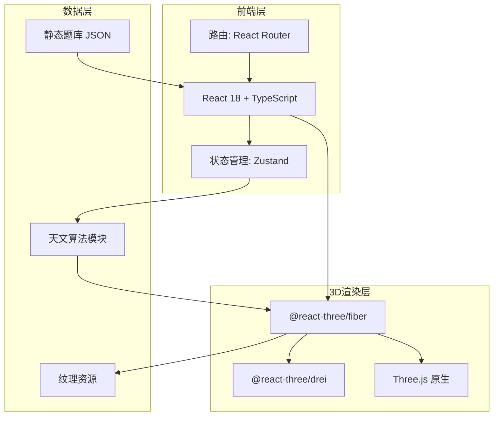

## 1. 架构设计



纯前端SPA架构，无需后端。所有数据静态化，天文计算在客户端完成。

## 2. 技术选型

- **前端框架**：React 18 + TypeScript
- **构建工具**：Vite 5
- **样式方案**：Tailwind CSS 3 + CSS Modules
- **3D引擎**：Three.js + @react-three/fiber + @react-three/drei
- **状态管理**：Zustand
- **UI组件**：自定义组件（玻璃态设计语言）
- **天文计算**：自实现（基于天文算法简化模型）
- **数据**：JSON静态题库文件

## 3. 项目结构

```
src/
├── App.tsx                    # 主入口
├── main.tsx                   # 挂载点
├── index.css                  # 全局样式 + Tailwind
├── components/
│   ├── Scene/
│   │   ├── MainScene.tsx      # 3D场景根组件
│   │   ├── Sun.tsx            # 太阳（发光体）
│   │   ├── Earth.tsx          # 地球（自转+纹理）
│   │   ├── Moon.tsx           # 月球
│   │   ├── OrbitLines.tsx     # 轨道线
│   │   ├── Atmosphere.tsx     # 大气层效果
│   │   ├── Starfield.tsx      # 星空背景
│   │   ├── TerminatorLine.tsx # 晨昏线
│   │   └── CelestialGrid.tsx  # 经纬网/参考面
│   ├── UI/
│   │   ├── TopBar.tsx         # 顶部标题栏
│   │   ├── KnowledgePanel.tsx # 左侧知识点面板
│   │   ├── ControlBar.tsx     # 底部控制栏
│   │   ├── ExamDrawer.tsx     # 右侧题目抽屉
│   │   ├── InfoOverlay.tsx    # 实时信息浮层
│   │   └── GlassButton.tsx    # 玻璃态按钮组件
│   └── common/
│       └── Tooltip.tsx        # 提示框
├── store/
│   └── useStore.ts            # Zustand全局状态
├── data/
│   ├── questions.ts           # 题库数据
│   └── knowledgePoints.ts     # 知识点结构
├── utils/
│   ├── astronomy.ts           # 天文计算（太阳赤纬、时角等）
│   └── constants.ts           # 常量定义
└── types/
    └── index.ts               # TypeScript类型定义
```

## 4. 路由定义

| 路由 | 用途 |
|-----|------|
| / | 三维主场景（唯一页面，所有功能在此页面内切换） |

单页应用，所有功能通过面板/抽屉切换，无需多路由。

## 5. 核心状态设计

```typescript
interface AppState {
  // 时间控制
  currentDate: Date;           // 当前模拟日期
  timeSpeed: number;           // 时间流速倍率 (0-100x)
  isPlaying: boolean;          // 是否自动播放

  // 视角控制
  cameraPreset: 'free' | 'top' | 'side' | 'northPole' | 'equator';
  
  // 知识点
  activeKnowledge: string | null;    // 当前激活的知识点ID
  showEquatorPlane: boolean;         // 显示赤道面
  showEclipticPlane: boolean;        // 显示黄道面
  showTerminator: boolean;           // 显示晨昏线
  showGridLines: boolean;            // 显示经纬网
  showSunRay: boolean;               // 显示太阳光线
  
  // 应试模式
  activeQuestion: Question | null;   // 当前题目
  isExamDrawerOpen: boolean;         // 题目抽屉开关
  
  // 标注显示
  highlightLatitude: number | null;  // 高亮纬度
  highlightLongitude: number | null; // 高亮经度
}
```

## 6. 天文计算模块

自实现简化天文算法，精确到满足高中地理教学需求：

- `getSolarDeclination(date)` — 计算太阳赤纬（直射点纬度）
- `getEquationOfTime(date)` — 均时差
- `getSunriseSunset(lat, date)` — 计算日出日落时间
- `getSolarAltitude(lat, lon, date)` — 计算太阳高度角
- `getDayLength(lat, date)` — 计算昼长
- `getEarthPosition(date)` — 计算地球在公转轨道上的位置

## 7. 性能策略

- 地球纹理使用压缩WebP格式，< 2MB
- 星空粒子使用BufferGeometry + PointsMaterial
- 使用React.memo优化组件重渲染
- 低端设备自动降级（减少粒子数、关闭后处理）
- 使用useFrame节流非关键更新